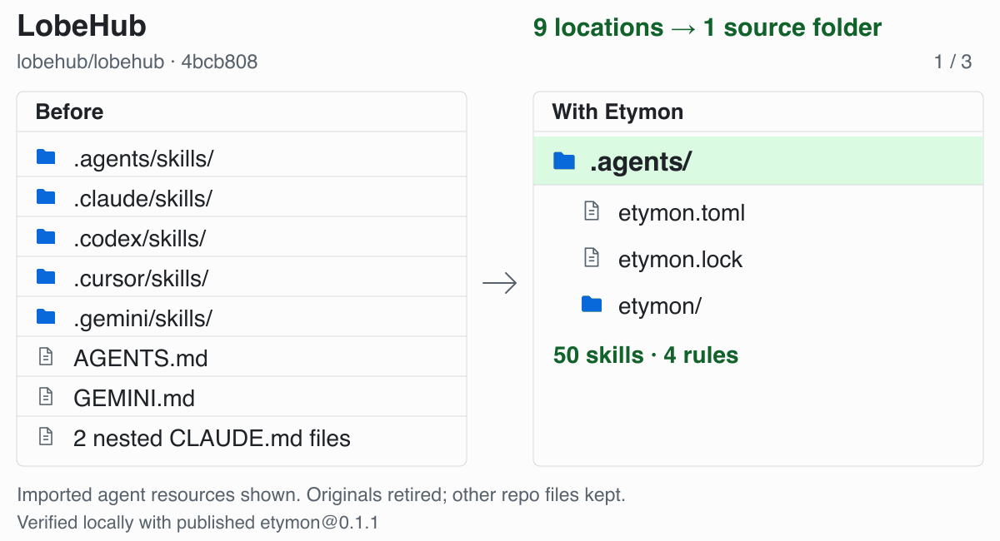

# etymon

Replace `CLAUDE.md`, `AGENTS.md`, `opencode.json`, `.codex/config.toml`, `.cursor/rules/`, `.mcp.json`, and other tool-specific setup with one shared manifest and lockfile: `etymon.toml` and `etymon.lock`.

Make your repositories portable and AI harness-agnostic with Etymon.

[Website](https://landoncrabtree.github.io/etymon/) · [CLI reference](docs/CLI.md)

## Use cases

<picture>
  <source media="(max-width: 600px) and (prefers-color-scheme: dark)" srcset="docs/assets/case-studies-dark-mobile.gif">
  <source media="(max-width: 600px)" srcset="docs/assets/case-studies-light-mobile.gif">
  <source media="(prefers-color-scheme: dark)" srcset="docs/assets/case-studies-dark.gif">
  
</picture>

[LobeHub](https://github.com/lobehub/lobehub) · [Ant Design](https://github.com/ant-design/ant-design) · [Formbricks](https://github.com/formbricks/formbricks). Real local migrations with `etymon@0.1.1`. Imported agent resources shown; other repo files kept.

## Install

```bash
npm install -g etymon
etymon

# Or run without installing globally
npx etymon
```

Node.js 22+ and Git for repository sources.

## New repo

```bash
etymon init

etymon skills add vercel-labs/skills --skill find-skills
etymon mcp add io.github.upstash/context7 --remote 0

# Create your own skills, agents, and rules
etymon skills create
etymon agents create
etymon rules create

etymon sync --harness claude,codex,opencode
```

### Contributors

```bash
etymon sync
```

## Existing repo

```bash
etymon init
etymon convert
etymon sync --harness codex,opencode
```

### Contributors

```bash
etymon sync
```

## Common commands

```bash
etymon skills find react
etymon mcp find context7
etymon mcp info io.github.upstash/context7

etymon skills add ./skills/checks
etymon agents add augmnt/agents/api-designer.md
etymon rules add ./guidance.md --dest-dir src/api
etymon mcp add ./mcp.json
etymon mcp create
etymon convert --harness claude # Import one tool

etymon list
etymon update             # Choose newer external versions
etymon sync               # Apply the locked versions
etymon sync --offline     # Use cached resources
etymon sync --dry-run     # Review changes
etymon sync --allow-lossy # Allow conversion losses, with warnings
etymon doctor

etymon skills remove checks
etymon agents remove reviewer
etymon rules remove guidance
etymon mcp remove docs

etymon skills create --global
etymon sync --global --harness claude,codex
etymon uninstall
```

[Full CLI reference](docs/CLI.md), including headless creation, source resolution, and global options.

## Interfaces and tools

| Interface            | Sources                                                               |
| -------------------- | --------------------------------------------------------------------- |
| Skills               | Local folders, [skills.sh](https://skills.sh), Git                    |
| MCP                  | Local JSON, [MCP Registry](https://registry.modelcontextprotocol.io/) |
| Agents               | Local files, Git, file URLs                                           |
| Rules & Instructions | Local files, Git, file URLs                                           |

Claude Code, Codex, Copilot CLI/cloud, VS Code, Gemini, Kiro, Pi, Oh My Pi, OpenCode, Cursor, Antigravity, Roo, Cline, Kilo, Continue, Windsurf, Amp, and Zed.

[Supported interfaces by tool](docs/CLI.md#supported-tools) · [Rule compatibility](docs/RULES.md)

## Contributing

Humans: [docs/CONTRIBUTING.md](docs/CONTRIBUTING.md).

Agents: run `etymon sync`, then read the generated project instructions and development skills.
